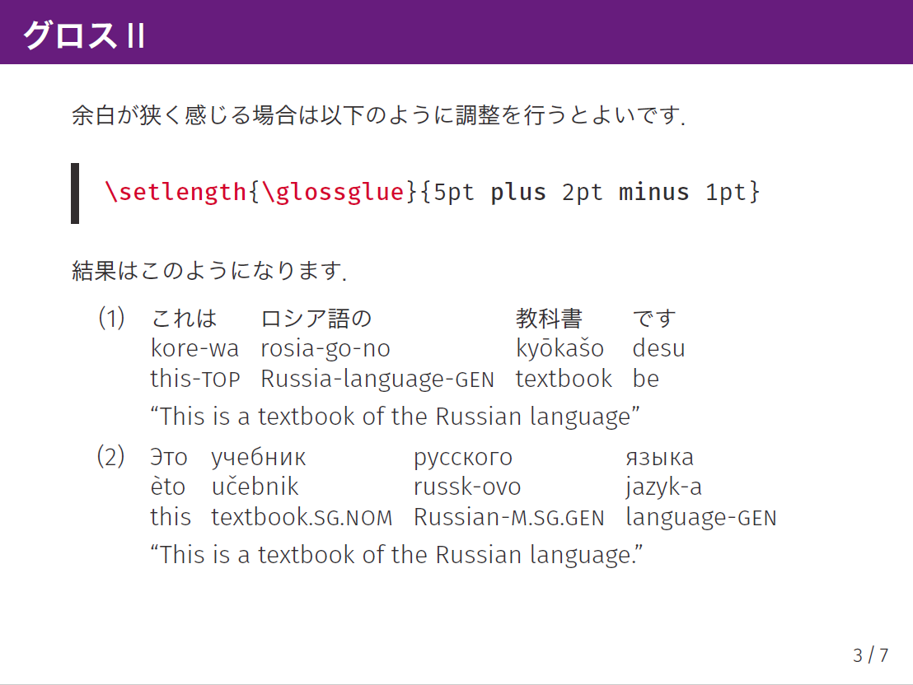

Sakura theme
============

これは主に日本語を対象とした beamer のテンプレートです．  
[mtheme](https://github.com/matze/mtheme) を元に作成しています．

## Requirements

+ [TeX Live 2021 or later](https://www.tug.org/texlive/)
+ [jecon.bst](https://github.com/ShiroTakeda/jecon-bst)

## Example

使用例のソースコードは `demo.tex` です．出力結果は `demo.pdf` になります．

## Typesetting

`latexmk demo.tex` で PDF が作成されます．
ファイルの変更が起きるごとにタイプセットしたい場合は `latexmk -pvc demo.tex` としてください．

## License

The picture [*Cat*](cat.jpg) by Selda Eigler is available in [flickr](https://www.flickr.com/photos/selda_eigler/8687127864/in/photolist-eeDNsC-qWFs4R-7CNDjJ-9c8DxY-eeDNhC-UCZ63T-dJNGUc-e5Nk39-988EVA-kUgwo-owDcVP-jQGjjt-5zkGTy-7WRCUo-b91XbZ-Mj8Ku-5pzwSA-9Bct2H-7CNHMY-7CJJMB-8MyEYn-9x45Mp-7JTq8M-ZrpGJ9-8fRht4-4SxVZT-5pzwjJ-ZsPJjL-aE44GL-dF6uWD-kqbHgM-5F373J-ZsQrVG-qyD7E9-ajyDPL-4WDvTp-KbDSc-5kCxD9-4MdeUo-pgDQcG-pPWrXD-662AFD-oTnC8k-apYceQ-nJSaaY-7CJLZv-7CJJMn-7CNFsU-XNMWkw-ccdtT9) and licensed under [CC BY 2.0](https://creativecommons.org/licenses/by/2.0/).

The other files are licensed under [CC BY-SA 4.0](https://creativecommons.org/licenses/by-sa/4.0/).
